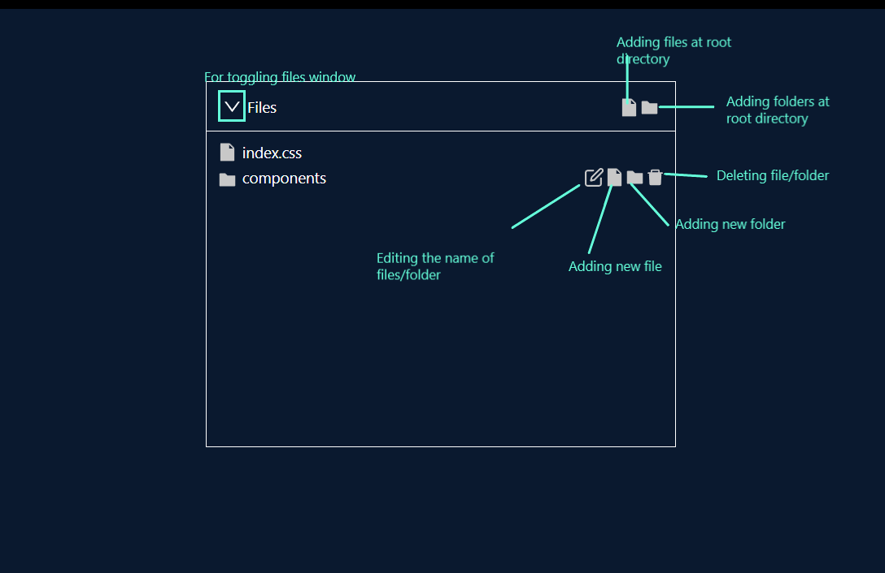

# Steps for running the repository locally

- Clone the repo using this command `git clone https://github.com/SihotiyaKartik/file-explorer`
- Go to the repo directory and run `npm install`
- Then run `npm start`

